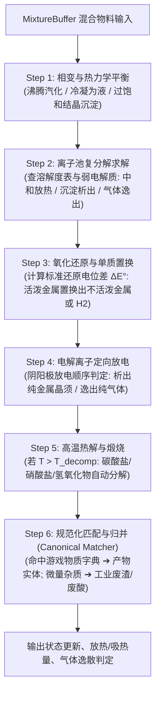

# 《元素纪元 2D》（Elemental Earth 2D）系统架构设计说明书 (ARCHITECTURE)

## 一、 总体分层架构模型

系统采用**低耦合、数据驱动（Data-Oriented）与多线程解耦**的现代化游戏架构，分为五大核心层：

```
┌────────────────────────────────────────────────────────────────────────┐
│                        1. 表现与渲染层 (Presentation Layer)             │
│  ┌───────────────────────┐ ┌──────────────────────┐ ┌────────────────┐ │
│  │ 2D Tilemap 与大世界视口│ │ 流体着色器/粒子特效  │ │ UI / HUD 界面  │ │
│  │ 微观实验台组装视口    │ │ (气泡/沉淀/变色/电弧)│ │ (周期表/蓝图库)│ │
│  └───────────────────────┘ └──────────────────────┘ └────────────────┘ │
└───────────────────────────────────▲────────────────────────────────────┘
                                    │ 事件驱动与状态只读插值 (Tick Interpolation)
┌───────────────────────────────────┴────────────────────────────────────┐
│                    2. 核心系统逻辑层 (Game Systems Layer)               │
│  ┌───────────────────────┐ ┌──────────────────────┐ ┌────────────────┐ │
│  │ 🪨 开采与地质系统     │ │ ⚙️ 工业物流与制造系统│ │ ⚗️ 实验反应系统 │ │
│  │ (矿脉/钻机/环境伤害)  │ │ (管网/传送带/反应器) │ │ (装置拓扑/蓝图)│ │
│  └───────────────────────┘ └──────────────────────┘ └────────────────┘ │
└───────────────────────────────────▲────────────────────────────────────┘
                                    │ 调用与调度
┌───────────────────────────────────┴────────────────────────────────────┐
│                  3. 唯象化学与物理模拟内核 (Simulation Core)             │
│  ┌──────────────────────────────────────────────────────────────────┐  │
│  │ 唯象化学反应求解器 (UniversalReactionSolver)                      │  │
│  │  ├─ 相变与溶解平衡求解器          ├─ 水溶液离子池复分解求解器   │  │
│  │  ├─ 氧化还原与金属置换求解器      ├─ 直流电解离子放电求解器     │  │
│  │  ├─ 高温热解与煅烧求解器          └─ 规范化物质匹配器           │  │
│  └──────────────────────────────────────────────────────────────────┘  │
│  ┌───────────────────────────────┐  ┌───────────────────────────────┐  │
│  │ 图拓扑流体网络 (Fluid Graph)   │  │ 连续传送带块 (Belt Chunks)    │  │
│  └───────────────────────────────┘  └───────────────────────────────┘  │
└───────────────────────────────────▲────────────────────────────────────┘
                                    │ 读写状态快照
┌───────────────────────────────────┴────────────────────────────────────┐
│                  4. 数据状态与网络同步层 (Data & Network Layer)          │
│  ┌───────────────────────────────┐  ┌───────────────────────────────┐  │
│  │ 世界权威状态 (World State)    │  │ 主机权威网络同步器 (Host-Sync)│  │
│  │ (ECS 连续内存快照)            │  │ (Steam P2P Relay / 增量差分)  │  │
│  ├───────────────────────────────┤  ├───────────────────────────────┤  │
│  │ 物质与常数库 (Substance DB)   │  │ 存档与 Mod 加载器 (ModLoader) │  │
│  └───────────────────────────────┘  └───────────────────────────────┘  │
└───────────────────────────────────▲────────────────────────────────────┘
                                    │ 硬件与操作系统桥接
┌───────────────────────────────────┴────────────────────────────────────┐
│                  5. 引擎抽象层 (Godot 4 / Unity Engine HAL)             │
└────────────────────────────────────────────────────────────────────────┘
```

---

## 二、 唯象化学模拟引擎设计（Universal Chemistry Engine）

### 2.1 物质状态核心数据结构

所有参与化学反应的物理容器（试管、烧杯、工业反应塔、管道内部），底层统一承载一个 **`MixtureBuffer`（混合物料池）**：

```csharp
// 单一化学成分实例 (按物质字典 ID + 摩尔量存储，实现精确化学计量比)
public struct ComponentEntry {
    public ushort SubstanceId;  // 对应 substances.json 中的数字 ID
    public float Moles;         // 摩尔量 (mol)
}

// 容器内的混合物理化学体系
public class MixtureBuffer {
    public List<ComponentEntry> Components = new(); // 组分列表
    public float Temperature = 293.15f;             // 体系温度 (Kelvin，默认室温 20℃)
    public float Pressure = 101.325f;               // 内部气相压力 (kPa，默认 1 atm)
    public float Volume = 1.0f;                     // 容器有效容积 (L)
    public float AppliedVoltage = 0f;               // 外加电解电压 (V)
    public bool HasLiquidWater = false;             // 是否存在液态水溶剂(离子池激活标志)

    // 辅助物理查询
    public float TotalMassGrams;                    // 体系总质量 (g)
    public float HeatCapacity;                      // 体系总热容 (J/K)
}
```

### 2.2 求解器处理流水线（Solver Pipeline）

求解器作为纯函数式计算服务，固定在 **30 TPS 逻辑 Tick** 中遍历执行受激发的反应容器：



### 2.3 动态元素发现探针（Element Discovery Probe）
- 求解器每次运行结束后，扫描当前反应器的最终组分。
- 探测逻辑：
  ```csharp
  foreach (var comp in buffer.Components) {
      var def = SubstanceDatabase.Get(comp.SubstanceId);
      // 判定是否为纯净单质且纯度达标 (>= 98%)
      if (def.IsPureElement && (comp.Moles / totalMoles) >= 0.98f) {
          if (!GlobalState.SharedPeriodicTable.IsUnlocked(def.ElementNumber)) {
              EventBus.Publish(new ElementDiscoveredEvent {
                  ElementNumber = def.ElementNumber,
                  DiscovererPlayerId = triggerPlayerId,
                  Timestamp = WorldTime.Now
              });
          }
      }
  }
  ```
- 彻底摒弃硬编码的任务追踪，任何化学反应提纯出单质，立刻全队触发点亮！

---

## 三、 工业化连续流物流系统（Industrial Pipeline Architecture）

### 3.1 图拓扑流体网络（Fluid Graph Network）
为了避免为每个管道内的流体滴单独创建对象，流体系统采用**连通图拓扑求解（Graph-based Topology）**：
- **网络合流**：相互物理连接的同介质管道自动融合成一个单一的 `FluidNetwork` 图实例。
- **压力平衡算法**：每个 Tick 计算输入泵总压、管道阻力系数与输出设备吸力，通过一元线性方程分配流量：
  $$Q_{out} = Q_{total} \times \frac{P_{in} - P_{back}}{R_{pipe}}$$
- **材质安全检验**：若管道材质为 `CastIron`（生铁），流体内包含强酸且 $pH < 2$，每秒对管道结构造成腐蚀损伤，直至爆管漏酸。

### 3.2 固体传送带的高性能 Chunk 数组（Belt Chunks）
- 直行连续的传送带拼装为一个 `ConveyorBeltChunk`。
- 内存结构为紧凑的结构体数组，仅存储物体 ID 与距离起点的归一化距离 $Offset \in [0.0, 1.0]$。
- 更新逻辑简化为一次数组向量加法（SIMD 友好）：$Offset_{new} = Offset_{old} + Speed \times \Delta t$。

### 3.3 工艺蓝图与工业反应器插槽系统

```csharp
// 工艺蓝图数据对象 (从实验室固化导出)
public class ProcessBlueprint {
    public string RecipeId;                  // 蓝图唯一标识
    public string Name;                      // 配方显示名称 (如: 接触法制硫酸)
    public ComponentEntry[] Inputs;          // 标准输入配比 (如: SO2 2mol, O2 1mol, H2O 2mol)
    public ComponentEntry[] Outputs;         // 理论产出配比 (如: H2SO4 2mol)
    public float MinOperatingTemperature;    // 最低运行温度 (如: 450℃)
    public float MaxOperatingTemperature;    // 最高允许温度
    public ushort? RequiredCatalyst;         // 所需催化剂 ID (如: V2O5 钒触媒)
    public float OptimalThroughputPerSecond; // 标准通量速率 (mol/s)
}

// 工业连续反应器实体组件
public class IndustrialReactorComponent {
    public ProcessBlueprint InstalledBlueprint; // 挂载的蓝图芯片
    public MixtureBuffer JacketBuffer;          // 夹套热交换缓冲池
    public float CurrentEfficiency;             // 当前运转效率 (受供料配比、温度、催化剂影响)
    public bool IsStarving;                     // 缺料停机标志 (用于触发逆向依赖雷达)
}
```

---

## 四、 网络同步与多人联机架构（Multiplayer Architecture）

采用 **Host-Authoritative（房主权威服务器）** + **客机预测与插值（Client Prediction & Interpolation）** 架构。

### 4.1 通信链路与协议
- **传输层**：基于 Steamworks SDK 的 **Steam Datagram Relay (SDR)**，自带 NAT 穿透、抗 DDoS 与防丢包加密，免除配置路由器端口映射。
- **局域网备选**：基于 UDP 的轻量可靠传输库（如 ENet / LiteNetLib）。

### 4.2 逻辑帧与渲染帧分离
- **逻辑模拟 Tick**：固定 **30 TPS**（严格计算化学反应、传送带推进、流体分配与状态机）。
- **画面渲染 Frame**：**60 ~ 144 FPS**（无锁帧平滑运动，根据前两帧网络快照进行 Hermite 曲线平滑插值）。

### 4.3 差异化压缩同步策略（Delta Snapshots）
面对庞大的自动化工厂，带宽优化规则如下：
1. **静态稳态休眠（Steady-State Dormancy）**：
   - 当某台反应器已连续 10 个 Tick 稳定按照恒定速率出料，主机给客机发送 `EnterDormant(EntityId, SteadyRate)` 消息；
   - 随后主机**停止发送该设备的网络包**；客机在本地根据 `SteadyRate` 自主维持传送带动画与管道粒子流动；
   - 仅当发生“断料、断电、超温报警、停机”时，重新发送激活状态帧。
2. **空间兴趣区域管理（Spatial Interest Management）**：
   - 世界划分为 $64 \times 64$ 瓦片的 Chunk。
   - 客机仅接收自身视口内及周边 1 个 Chunk 的微观实体数据（散落矿石、细微气泡粒子）；远距离厂区仅以 1 Hz 频率同步宏观产能汇总。

---

## 五、 数据驱动规范与 Mod 扩展（Data Schemas）

所有游戏静态元数据完全存放在外置 JSON 文件中，游戏启动时一次性加载为只读内存字典。

### 5.1 核心物质定义规范（`substances.json`）
```json
{
  "key": "copper_sulfate",
  "name": "硫酸铜",
  "formula": "CuSO4",
  "molar_mass": 159.609,
  "standard_phase": "solid",
  "melting_point_k": 383.15,
  "decomp_temp_k": 923.15,
  "decomp_products": [
    { "substance": "copper_oxide", "moles": 1 },
    { "substance": "sulfur_trioxide", "moles": 1 }
  ],
  "ions": { "cation": "Cu2+", "anion": "SO4_2-" },
  "solubility_curve": [
    { "temp_k": 273.15, "g_per_100g_water": 14.3 },
    { "temp_k": 373.15, "g_per_100g_water": 75.4 }
  ],
  "color_rgba": [0.15, 0.45, 0.95, 1.0],
  "corrosiveness": "weak_acid"
}
```

### 5.2 物理常数与规则表（`constants.json`）
- 存储标准电极电势表（$E^\circ$ 序列）、无机沉淀溶解度积常数（$K_{sp}$）、酸式分解阈值。

---

## 六、 性能优化与工程关键设计

1. **零垃圾回收（Zero-GC in Core Loop）**：
   - 30 TPS 逻辑 Tick 循环中**严禁任何堆内存动态分配（`new` 操作）**。
   - 所有化学反应中间体、离子池重组计算全部使用预分配的环形对象池（Object Pool）或非托管原生内存块（`NativeArray` / 栈分配 `Span<T>`）。
2. **多线程调度模型（Job System / Task Threading）**：
   - **主线程**：负责 UI 输入响应、渲染指令提交、玩家角色控制。
   - **模拟工作线程（Worker Threads）**：
     - Thread 1: 流体压力网络图拓扑求解；
     - Thread 2: 固体传送带数组 SIMD 批量位移；
     - Thread 3: 唯象化学求解器（按 Chunk 并行处理各反应器）。
3. **安全存档防坏档策略（Atomic Save）**：
   - 存档采用“双缓存临时文件写入 + 原子重命名（Atomic Rename）”机制。
   - 只有当新的存档完整写盘校验通过后，才替换原存档，彻底规避游戏断电或崩溃导致的存档损坏。
